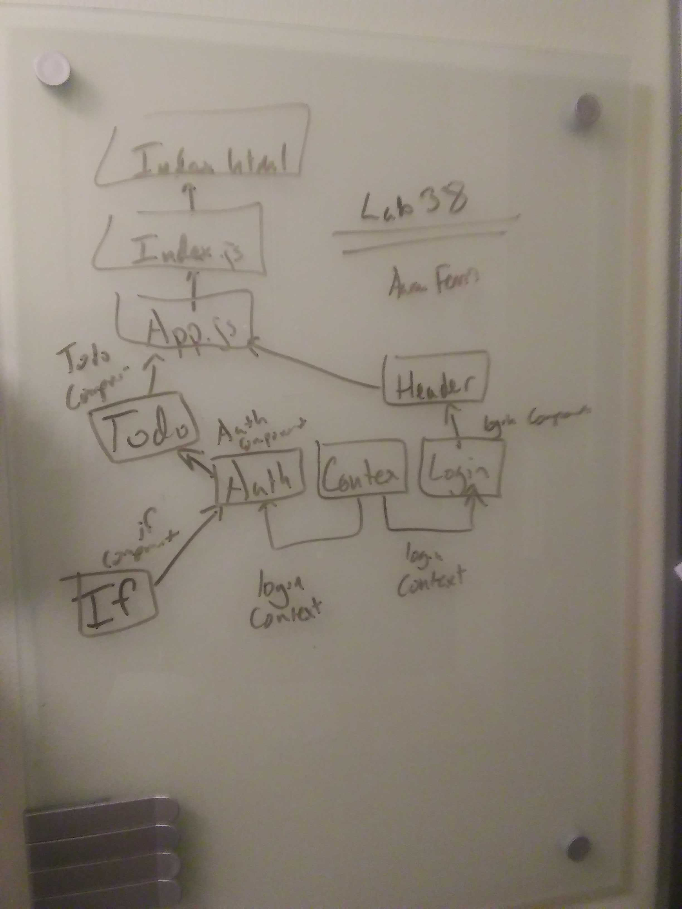

 Lab 38: Hooks
============================================================================  
Date: May 8th, 2019  
Author: Aaron Ferris

[Code Sandbox Link](https://codesandbox.io/s/github/abferris/lab34)  
[Pull request](https://github.com/abferris/lab34/pull/1)  
[LAB INSTRUCTIONS](./LAB.md)

## Assignment

### Setup

[x] Create a `.env` file with the following values

```javascript
[x] REACT_APP_API=https://api-js401.herokuapp.com
[x] REACT_APP_SECRET=supersecret
```

### Login/Auth System

[x] Convert the `<Login />` and `<Auth />` components from classes to functional components
[x] Implement the `useContext()` hook to tap into the Login Context
[x] Use the `useState()` hook in the `<Login />` component to manage form state as the user types.

### To Do Component

Note that this component is protected by the `<Auth />` system, so make sure that this functionality remains intact.

[x] Convert from class to a function component
[x] Use the `useReducer()` hook to manage the To Do List items list
[x] Use the `useState()` hook to manage the form

### Stretch Goals:å

[ ] Style it!

## Approach and drawing


